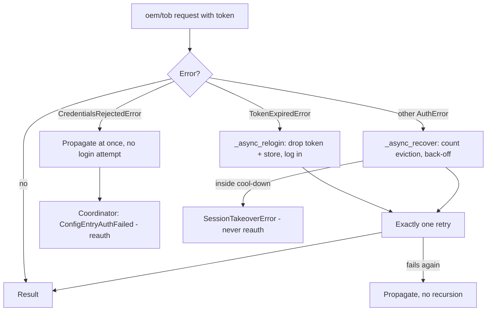

# Expired-token re-login and manual token refresh

Date: 2026-08-09
Status: approved, not yet implemented

## Problem

`AuthManager.oem()` / `tob()` already retry a rejected request once by logging in again with
the stored credentials, and the credentials are in the config entry, so a re-login survives a
Home Assistant restart. What is wrong is the path that retry takes.

`_async_recover()` treats **every** `AuthError` as a session takeover. It increments
`_evictions`, applies the `LOGIN_BACKOFF_SECONDS` cool-down and may raise
`SessionTakeoverError` instead of logging in at all. A token that simply reached the end of
its lifetime is therefore charged as "the phone stole the session": the back-off escalates,
and the poll that hit the expired token is abandoned rather than retried.

The three auth business codes are indistinguishable today — `{5, 14005, 3114016}` all become
a bare `AuthError` in `transport/http.py`.

There is also no way for the user to force a fresh login. Recovering from a wedged session
currently means reloading the config entry or re-entering the password.

## Decisions taken

- **Classify by cloud business code**, not by observed behaviour. A behavioural heuristic
  ("the first failure after a long-lived token is an expiry") was considered and rejected in
  favour of an explicit mapping.
- **Two new exception subclasses**, following the existing `SessionTakeoverError` precedent,
  rather than attaching a `code` attribute to `AuthError`. Business codes stay inside the
  transport; the rest of the codebase keeps dealing with the small transport-agnostic set.
- **Manual refresh is exposed as both a service and a button**, the service being the primary
  mechanism.

### Known risk

The code-to-meaning mapping is reconstructed from test fixtures, not from vendor
documentation. If `14005` turns out to mean "the session was claimed elsewhere", the
ping-pong protection stops applying to it. This is the first place to look if logs start
showing frequent re-logins. Unrecognised auth codes deliberately keep today's behaviour, so
the blast radius is limited to the two codes named below.

## Design

### 1. Error classification — `aiodollin/exceptions.py`, `aiodollin/transport/http.py`

Two new subclasses of `AuthError`:

- `TokenExpiredError` — the access token is no longer accepted; a fresh login fixes it.
- `CredentialsRejectedError` — the cloud refused the account or password itself.

`_AUTH_CODES` splits into three cases:

| Response | Exception | Basis |
|---|---|---|
| code `14005` | `TokenExpiredError` | fixtures label it "token invalid" |
| code `3114016` | `CredentialsRejectedError` | fixtures label it "wrong credentials" |
| code `5`, HTTP 401/403 | bare `AuthError` | meaning unknown → today's takeover branch |

HTTP 401/403 stay a bare `AuthError` on purpose: in practice the cloud answers `200` with a
business code in the body (as the fixtures show), so status codes are a rare path and there
is nothing to base a guess on.

`tests/aiodollin/test_http.py:91` keeps passing unchanged — the subclasses satisfy
`isinstance(..., AuthError)`.

### 2. `AuthManager` — three branches instead of one

The expiry branch must not touch `_evictions`, `_last_eviction` or `_cooldown()`. A natural
TTL expiry stops escalating a back-off that exists to fight the mobile app.

`CredentialsRejectedError` propagates without attempting a login — exactly the account-lockout
protection the comment at `coordinator.py:425` already worries about.

A shared private `_async_relogin()` (clear `self._token`, `store.clear()`, `async_login()`)
serves both the expiry branch and the manual refresh. Clearing the store matters: without it
a failed login leaves a dead token behind that `async_get_token()` would later hand out as
usable.

The one-retry contract is unchanged. A retry that fails again propagates; nothing recurses.

### 3. Manual refresh

- `AuthManager.async_refresh_token()` — `_async_relogin()` plus a reset of `_evictions` and
  `_last_eviction`. The user has explicitly said "take the session now", so the back-off must
  not veto it and must not stay escalated afterwards.
- Exposed on the façade as `DollinClient.async_refresh_token()`.
- `HolabrainCoordinator.async_refresh_token()` — re-login only, no data poll; polling already
  has the `refresh_now` button. On `CredentialsRejectedError` / `AuthError` it starts the
  reauth flow and raises `HomeAssistantError` with a translated message.
- Service `holabrain.refresh_token` in `services.py`, reusing the existing `_REFRESH_SCHEMA`
  (`config_entry_id` / `device_id`).
- `HolabrainRefreshTokenButton` in `account.py`: `EntityCategory.DIAGNOSTIC`, **disabled by
  default**. It signs the user out of the vendor's mobile app, which an accidental tap should
  not do.

The cooperative-mode invariant holds: a silent re-login only happens inside a request that was
already initiated, never on the integration's own initiative. Manual refresh works in both
modes — it is a direct instruction from the user.

### 4. Tests

- `tests/aiodollin/test_http.py` — the three codes map to the three classes.
- `tests/aiodollin/test_auth.py` — an expiry produces exactly one re-login and leaves
  `evictions == 0`; rejected credentials produce no login attempt at all; a retry that fails
  again propagates without recursing.
- `tests/aiodollin/test_session_takeover.py` — the back-off does not fire on
  `TokenExpiredError`; `async_refresh_token()` logs in immediately even inside a cool-down and
  clears the counter.
- `tests/test_services.py` — the service re-logs-in; rejected credentials start reauth and
  raise `HomeAssistantError`.
- `tests/test_account_entities.py` — the button exists, is disabled by default, and reaches
  the same path.

### 5. Maintenance

- Minor version bump `0.14.0` → `0.15.0` in both `pyproject.toml` and `manifest.json` (a new
  service and a new entity).
- Service and button strings in `strings.json`, mirrored into all five of
  `translations/{en,ru,be,kk,uz}.json`, plus `icons.json` entries; verified by
  `scripts/check_translations.py`.
- `CHANGELOG.md` under `## [Unreleased]`; a Services row in `README.md`; a note in
  `docs/accounts.md` that a manual refresh signs the mobile app out.
